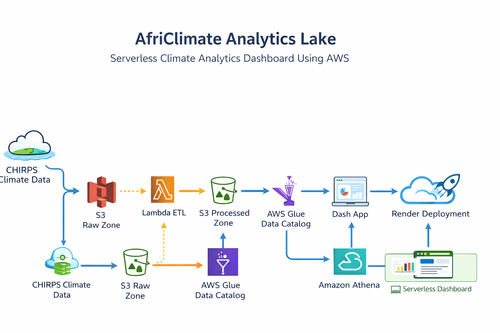
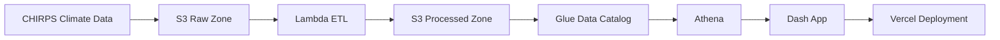
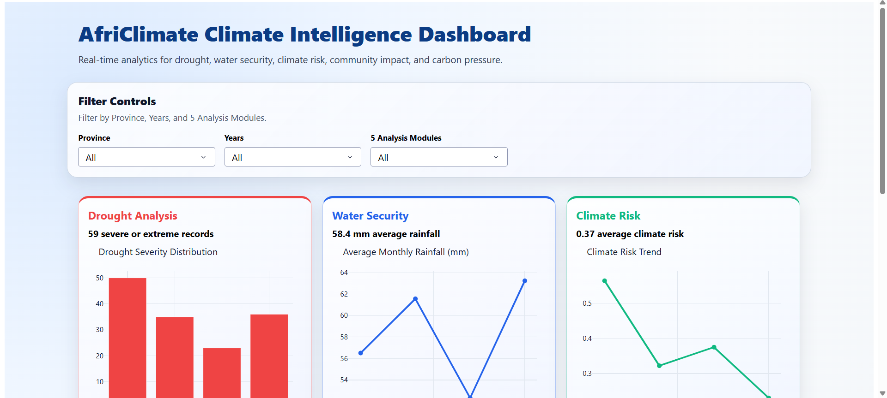
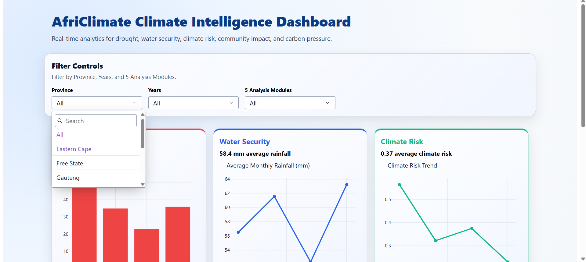
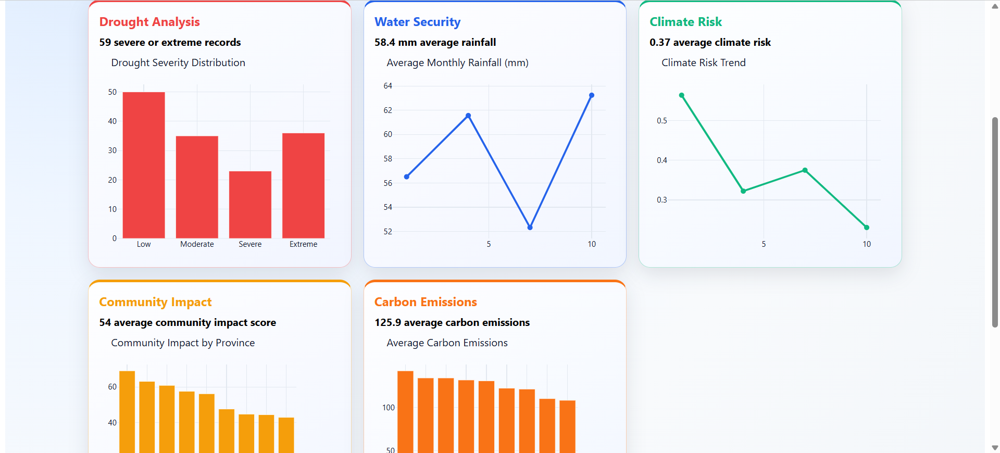

# AfriClimate Analytics Lake


Serverless climate analytics platform for Southern Africa, built with AWS services and a production-ready Dash dashboard.

## Project Snapshot
- Problem: climate monitoring data is hard to operationalize quickly for decision-making.
- Solution: a serverless pipeline with an interactive dashboard for drought, water security, climate risk, community impact, and carbon insights.
- Deployment: live on Vercel.
- Stability mode: fallback dataset enabled for guaranteed dashboard visibility.
- Cost profile: designed for low-cost operation on cloud free tier + lightweight query usage.

## Live Dashboard
- URL: `https://kutlwano-take-africlimate-analytics-eight.vercel.app/`

## Architecture Diagram


If the image is not available yet, the architecture flow is below:



## Core Stack
- Data layer: AWS S3, AWS Glue, Amazon Athena
- Application layer: Dash + Plotly
- Hosting: Vercel (Python serverless function)
- Language/runtime: Python 3.12

## Repository Structure
- `app.py`: Dash application (main entrypoint)
- `api/index.py`: Vercel Python serverless entrypoint
- `vercel.json`: Vercel routing configuration
- `requirements.txt`: Python dependencies
- `.env.example`: environment variable template
- `sql-queries/`: Athena SQL queries
- `extensions/`: optional extension modules
- `scripts/`: utility scripts
- `SUBMISSION_PACKAGE/`: submission-specific artifacts

## Run Modes
| Mode | Purpose | Config |
|---|---|---|
| Fallback Mode (default) | Guaranteed visible dashboard data for demos/submission | `FORCE_FALLBACK_DATA=true` |
| Athena Mode | Live cloud-backed query results | `FORCE_FALLBACK_DATA=false` + AWS env vars |

## Local Run
```bash
python -m venv venv
venv\Scripts\activate
pip install -r requirements.txt
python app.py
```

Open: `http://127.0.0.1:8050`

## Deployment (Vercel)
- Framework Preset: `Other`
- Root Directory: `./`
- Python Version: `3.12` (pinned in `.python-version`)
- Vercel config files: `vercel.json` + `api/index.py`

### Required Environment Variables
- `FORCE_FALLBACK_DATA=true`
- `DASH_DEBUG_MODE=false`

### Optional AWS Variables (Athena mode only)
- `AWS_ACCESS_KEY_ID`
- `AWS_SECRET_ACCESS_KEY`
- `AWS_DEFAULT_REGION`

## Challenges and Solutions
| Challenge | Impact | Resolution | Status |
|---|---|---|---|
| Athena/network instability on hosted runtime | Empty or delayed charts | Added default fallback dataset mode | Resolved |
| Runtime/deploy mismatch across environments | Inconsistent startup behavior | Pinned Python version and aligned Vercel serverless entrypoint | Resolved |
| Callback non-trigger risk during development | Charts not updating | Verified callback wiring, IDs, and output bindings | Resolved |

## Dashboard Overview
### Homepage View


### Filter Interaction View


### Chart Detail View


## Roadmap
1. Enable authenticated access and role-based dashboard views.
2. Add scheduled ingestion and freshness indicator on dashboard.
3. Integrate real-time alerting (drought/water-risk thresholds).
4. Add unit/integration tests for ETL and callback logic.
5. Add CI checks for linting, security scan, and deployment validation.

## Security Checklist
- No hardcoded API keys or secrets in source code.
- Keep real credentials only in environment variables.
- Never commit `.env` with real values.
- Run pre-push secret scan before publishing.

## Submission Highlights
- End-to-end serverless data-to-insight architecture.
- Five climate analytics modules with interactive filtering.
- Deployment hardened for reliability under deadline constraints.
- Cleaned repository and documentation aligned to final submission.

## Project Status
- Dashboard callbacks wired and verified.
- Fallback data path active by default for stable demo behavior.
- Vercel deployment configured and live.
